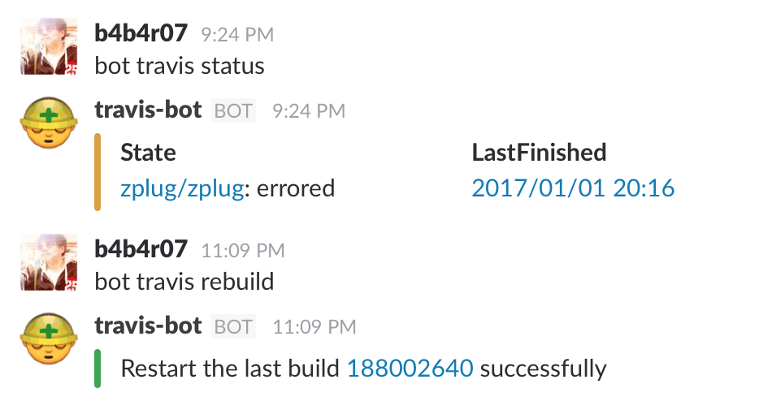
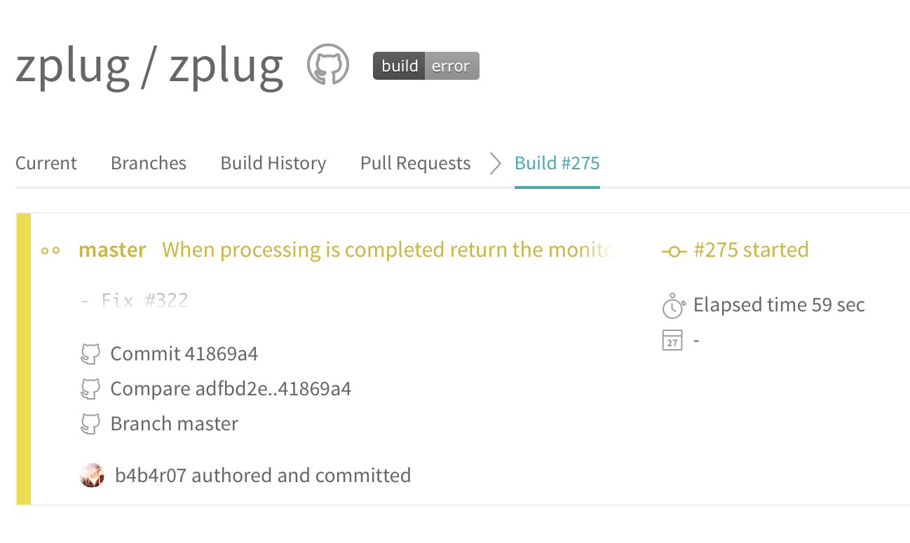

travis-bot
==========

A bot that accesses various Travis APIs on Slack

## Installation

```console
$ go get -d github.com/b4b4r07/travis-bot
```

## Usage

On Command-line:

```conole
$ export SLACK_TOKEN=xxx
$ export TRACIS_CI_TOKEN=yyy
$ ./travis-bot -user=zplug -repo=zplug
```

On Slack:

```
> bot travis help
> bot travis status
> bot travis rebuild
```



It can be easily restart to the last built:



## License

[MIT](./LICENSE)

## Author

@b4b4r07
